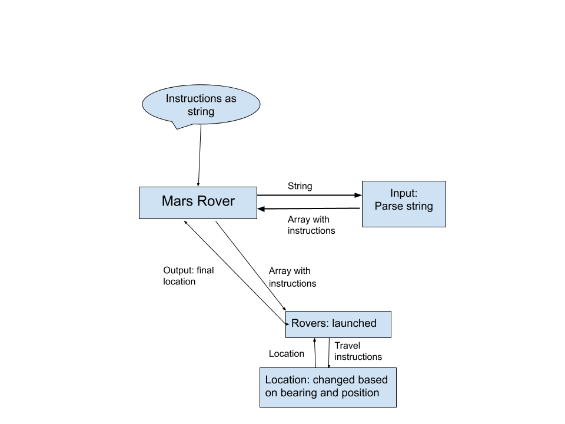

# Mars Rover

This is a coding solution to the Mars Rover problem.

The problem: The rovers are to navigate around a plateau in Mars to send back pictures of the surrounding terrain back to Earth. A program needs to be built to control how the rover gets round the plateau.

This is a tech test provided by ThoughtWorks. See full task [here](TASK.md).

### Build status
[](https://travis-ci.com/riyadattani/mars-rover)

### How to use

Install tech needed in console:
```
bundle install
```
Open root file and check tests (inluding coverage):
```
rspec
```
Run program in console:
```
ruby run_mars_rover.rb
```
Change input:
 - Open `run_mars_rover.rb` and manipulate the string passed into the `instruct` method.
 - The first two numbers decide the plateau size
 - The next line (separated by \n) determines the rovers position followed by instructions for the rover to travel (you can add the position and instructions of more rovers in the same format)

### Modelling



### Tech and testing

**Built using**
- Ruby 2.6.1
- Tested using Rspec

**Linter**
- Rubocop 0.62.0

**Coverage**
- 100%
- Simplecov

### Acceptance Criteria

Test Input:
```
5 5

1 2 N

LMLMLMLMM

3 3 E

MMRMMRMRRM
```

Expected Output:
```
1 3 N

5 1 E
```
